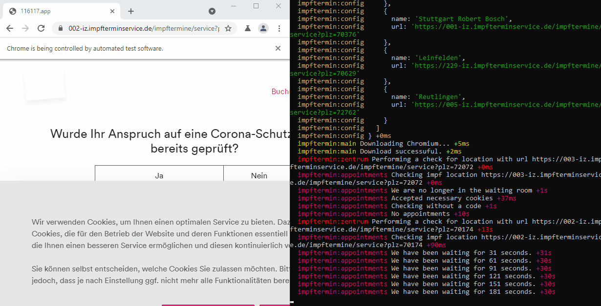
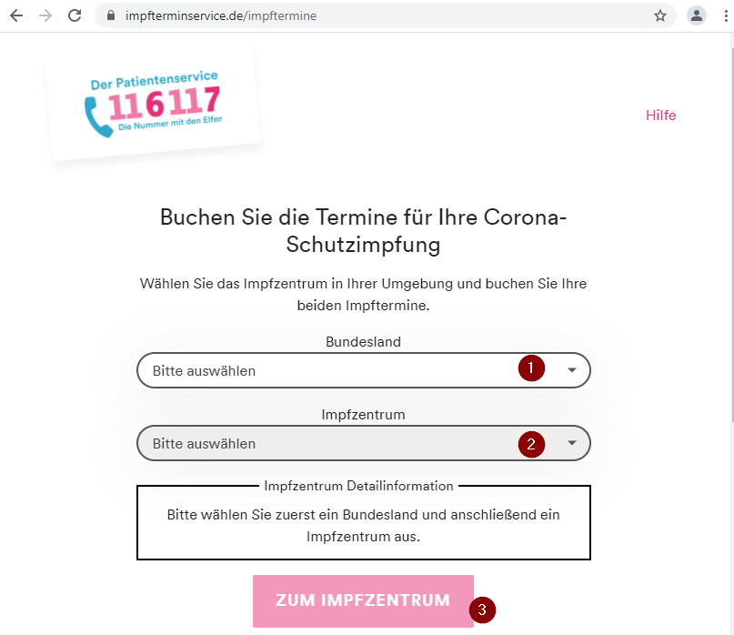

<p>
  <a href="https://github.com/marcoklein/impftermin/releases/latest" alt="Download">
    
  </a>
  <a href="https://github.com/marcoklein/impftermin/releases/latest" alt="Download">
    
  </a>
</p>

# German Corona Impftermin Helper

Find an Impftermin or Impfcode on [impfterminservice.de](https://www.impfterminservice.de/).

<p align="center">
  <a href="https://github.com/marcoklein/impftermin/releases/latest" alt="Download">
    
  </a>
</p>

Automatically checks the website and notifies you about open appointments and available Impf-Codes.  
The app opens a Chrome browser and automatically navigates through the page. It beeps if it finds an open slot. You enter personal information and book the appointment manually.

## Installation

Head over to [Releases](https://github.com/marcoklein/impftermin/releases) and [download the latest version](https://github.com/marcoklein/impftermin/releases/latest).

Currently the following platforms are supported:

- Windows (x64)
- Linux (x64)
- macOS (x64)

### Windows

Download `impftermin-win.exe` and double-click the file.

### Linux

Download `impftermin-linux` and open a terminal in the same folder.

Make the file executable using `chmod +x impftermin-linux` and run it using `./impftermin-linux`.

### macOS

Download `impftermin-macos` and open a terminal in the same folder.

Make the file executable using `chmod +x impftermin-macos` and run it using `./impftermin-macos`.

---

A command-line window will show up and you can fill in the Impftermin locations there:

<p align="center">
  <a href="https://github.com/marcoklein/impftermin#getting-an-impfzentrum-url" alt="Download">
    
  </a>
</p>

Get the Impftermin locations directly on [impfterminservice.de](https://www.impfterminservice.de/) as section [Getting an Impfzentrum url](#getting-an-impfzentrum-url) describes.

The application will use any `config.json` it finds in the current or parent folder.
To change your configuration with the interactive CLI delete the `config.json`.

If you have questions, something doesn't work or you want a new feature then please create a new [issue](https://github.com/marcoklein/impftermin/issues/new/choose).

## Getting started with development

You need to install NodeJS in order to run this program:
https://nodejs.org

Then install yarn with

```bash
npm install --global yarn
```

Install dependencies

```bash
yarn
```

Run with

```bash
yarn start
```

Answer the prompts to create a `config.json` or manually create your own (as described in [Configuration](#configuration)). The application makes a sound when started. Ensure, that you hear the sound and adjust your sound settings if needed. Impftermin will play that sound if it finds an available slot.

# Project setup

I focused on concise and easy to read code. Comments are in place to improve understanding even though one might argue that comments describing code are not good practice.
You might need to get your head around `async` and `await`.

## Configuration

Impftermin loads the `config.json` from its starting folder. It walks over the defined queue and checks for open appointments for each entry. If you leave the code empty it checks if there are open slots to get a new Impfcode. If you specify a code it will enter the code on the specified location.

Impftermin will walk through the queue and interrupts the app for 25 minutes if it finds an open appointment or an open slot to retrieve a code.

> You need to enter your personal data by your own then!

The intervalInMinutes property defines the timeout between two website checks.

```json
{
  "intervalInMinutes": 15,
  "queue": [
    {
      "url": "https://002-iz.impfterminservice.de/impftermine/service?plz=XXXXX",
      "code": null
    },
    {
      "url": "https://002-iz.impfterminservice.de/impftermine/service?plz=XXXXX",
      "code": "XXXX-XXXX-XXXX"
    }
  ]
}
```

### Getting an Impfzentrum url

A queue entry defines a `url` and `code`. Get the url by choosing your Impf-Zentrum from https://www.impfterminservice.de/impftermine, press "zum Impfzentrum"...



... and copy that url.


## Process

The following chart describes how Impftermin will check the site:


## Logging

We use [debug](https://www.npmjs.com/package/debug) to print logs.
The application logs with the namespace `impftermin`.

So to include all logs set the DEBUG environment variable to `impftermin:*`.

Logs are enabled by default.

## Environment variables

You may configure a `.env`.
Using Telegram is optional. Check their docs if you want to configure a bot to get notifications about open appointments.

```
TELEGRAM_TOKEN=<personal-Telegram-Bot-Token>
TELEGRAM_CHAT_ID=CHAT_ID_1 [, CHAT_ID_2] ...
```

If you are behind a reverse proxy (e.g. company proxy) you need to set the environments HTTPS_PROXY variable in order to make the Telegram bot work.
```
HTTPS_PROXY=http[s]://[host]:[port]
```

## Dependencies

- [puppeteer](https://www.npmjs.com/package/puppeteer) for browser automation
- [telegraf](https://www.npmjs.com/package/telegraf) for Telegram notification
- [debug](https://www.npmjs.com/package/debug) for logging

For development

- [env-cmd](https://www.npmjs.com/package/env-cmd) to load environment variables
- [release-it](https://www.npmjs.com/package/release-it) for automated GitHub releases
- [pkg](https://www.npmjs.com/package/pkg) to package an application

## Tested on

- Windows 10, Node 14
- Debian 10, Node 14

# Attribution and legal

Due to this project being focused on the German website for vaccination appointments some documentation is written in German.
Docs cover technically concerns mostly in English and sometimes Denglisch.

## Licenses

- [Sound](https://opengameart.org/content/completion-sound) from OpenGameArt.org
